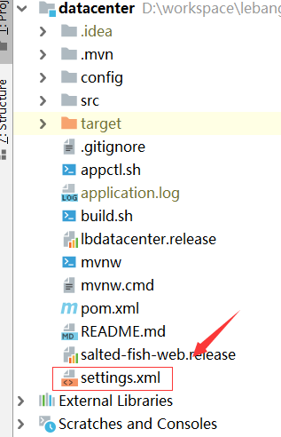

#说明
   1. 这里使用的是私有的仓库，所以这个要向管理员要一份最新的配置文件setting.xml并且把这个个文件放到项目的根目录下面
    
   2. POM.xml 引入 (版本自己选择，正常要使用最新版本)
   
```xml
    <dependency>
        <groupId>com.lebangsdk</groupId>
        <artifactId>lebangsdk-web</artifactId>
        <version>1.1.3</version>
    </dependency>
```

